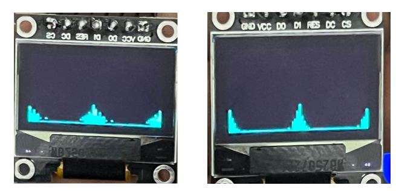
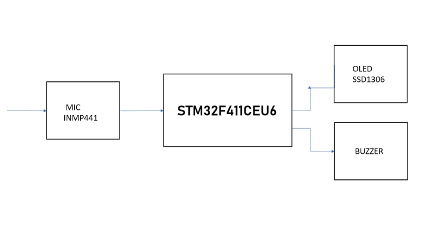

# 🔊 Noise Pollution Monitoring System

## 📌 Overview
The Noise Pollution Monitoring System is a real-time embedded solution designed to measure and analyze environmental noise using Digital Signal Processing (DSP) techniques. 

It uses an STM32F411 microcontroller and a MEMS microphone to capture sound, compute its intensity, and visualize the frequency spectrum. The system also triggers alerts when noise exceeds a predefined threshold.

---

## 🎯 Objectives
- Monitor environmental noise in real time  
- Perform FFT-based frequency analysis  
- Display sound intensity in decibels (dB)  
- Provide alert for excessive noise levels  

---

## 🛠️ Hardware Components
- STM32F411CEU6 Microcontroller  
- INMP441 MEMS Microphone  
- OLED Display (SSD1306)  
- Buzzer  
- Power Supply  

---

## 💻 Software & Technologies
- Embedded C (STM32 HAL)  
- CMSIS-DSP Library  
- Fast Fourier Transform (FFT)  
- I2S Communication  
- DMA  

---

## ⚙️ Working Principle
1. The MEMS microphone captures ambient sound as digital signals via I2S  
2. STM32 processes the signal using DSP algorithms  
3. RMS value is calculated to determine sound intensity  
4. FFT is applied to convert time-domain signal into frequency domain  
5. Noise level is converted into decibels (dBFS)  
6. If noise exceeds threshold → buzzer alert is triggered  
7. OLED displays real-time sound level and frequency spectrum  

---

## 📊 Features
- Real-time noise monitoring  
- Frequency spectrum visualization  
- Threshold-based alert system  
- Compact and low-cost design  
- Standalone embedded system (no external PC required)  

---

## 📈 Results
- Quiet environment: ~ -60 dBFS  
- High noise environment: ~ -10 dBFS  
- Accurate real-time response  
- Stable FFT-based processing on STM32  

---

## 📷 Output

---

## 🔧 Block Diagram

---

## 📄 Project Report
[Download Full Report](doc/project-report.pdf)

---

## 🚀 Future Enhancements
- IoT-based remote monitoring  
- Cloud data logging  
- AI-based noise classification  
- Multi-sensor environmental monitoring system  

---

## 👨‍💻 Authors
- Shanil TP  
- Hafiz Ahmed C  
- Adhil Fayad CP  
- Nimil VP  

---

## 📌 Keywords
Embedded Systems, DSP, STM32, FFT, Noise Monitoring, IoT
